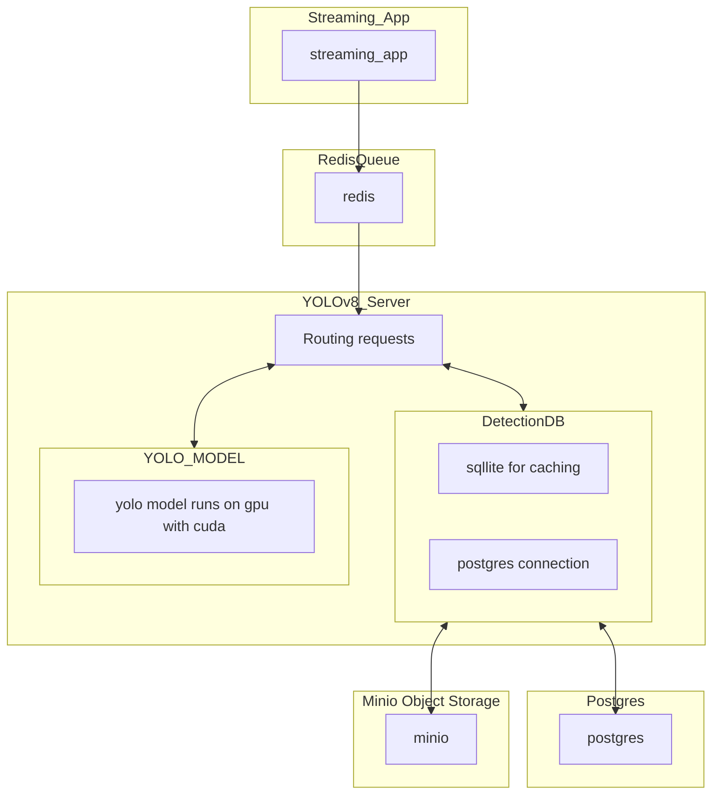

# Edge Device Object Detection

# Project Architecture



# Project structure
```
.
├── README.md
├── app
│   ├── Dockerfile
│   ├── requirements.txt
│   ├── src
│   │   ├── config.py
│   │   ├── db_util.py
│   │   ├── image_storage.py
│   │   ├── postgres_util.py
│   │   ├── redis_client.py
│   │   ├── stream_processor.py
│   │   └── util.py
│   └── yolov8_api.py
├── container_settup.md
├── data
├── devcontainer
│   └── devcontainer.json
├── images
│   └── free-photo-of-downtown-toronto-street-scene-with-traffic.jpeg
├── logs
│   ├── image_processor.log
│   ├── stream.log
│   ├── stream_processor
│   └── yolov8_server.log
├── models
│   └── yolov8n.pt
├── output
│   ├── detections.log
│   └── output_with_boxes.jpg
├── podman-compose.yml
├── postgres_data  [error opening dir]
├── streaming_app
│   ├── Dockerfile
│   ├── image_processor.py
│   └── requirements.txt
└── test_app
    ├── Dockerfile
    ├── logs
    ├── requirements.test.txt
    ├── test.jpg
    ├── test_detection.py
    ├── test_detection_id.py
    ├── test_detections.py
    ├── test_post.py
    ├── test_stream.py
    └── util.py

13 directories, 34 files
```