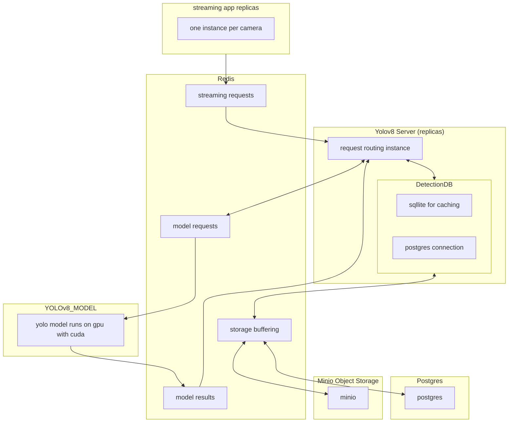

# Edge Device Object Detection
Yolov8 model inference on an edge device

# Purpose / Vision
Providing real-time, private, reliable video analytics on the edge device, avoiding use of cloud in the process control loop. Leveraging existing cameras on site to potentially provide additional process insight. Low hanging fruit would be PPE compliance and area access control.
Access to detection data would be provided to the client for additional diagnosis as required. But regularly, only a heartbeat would be streamed to the cloud and wider integrated system.

# How is this used?
- Connect IP/RTSP cameras to the device
- Run the Edge Device, which automatically:
  - Pulls the stream
  - Runs Yolo inference  
  - Saves processed frames and detection results to a backend (DB/Minio)
- View a web Dashboard (to be implemented)
  - See processed video data (bounding boxes)
  - Search by detection data
  - validate model performance

# Timing / Strategic Value - Why Bother?
## Why Edge
Use of cloud is very popular and has many application for wide business application. Edge computing, however fits the industries Hatch consults much better. Sites easily have space for a local machine, and cost of a linux based edge device is laughable compared to instrumentation that is regularly used. Control loops should not have cloud device inside it, it introduces unnecessary risk. Edge device is local and acts locally, yet when required additional compute power, backup and other cloud strengths can be leveraged when required.
## Why Computer Vision
This comes from an assumption that a camera would just be there anyway. There are some old sites that don't have cameras, but lets ignore that. Any industrial site should have cameras and a computer on site. There are many ways a camera feed can give additional information to the operator, even direct process insight (water level for example). Getting safety insight is valuable. Once you have the ability of who and what is going where you can derive process insight and operator value.
# Project Architecture


```mermaid
flowchart TB
    subgraph Streaming_Apps[streaming app replicas]
        cameras["one instance per camera"]
    end

    subgraph Redis
        direction TB
        STREAM[streaming requests]
        MODEL_REQUESTS[model requests]
        MODEL_RESULTS[model results]
        STORAGE_BUFFER[storage buffering]
    end

    subgraph YOLOv8_Server["Yolov8 Server (replicas)"]
        FAST_API["request routing instance"]
        %% DetectionDB bellow FAST_API
        direction TB
        subgraph DetectionDB
            CACHE[sqllite for caching]
            PG_CLIENT[postgres connection]
        end
    end

    subgraph YOLOv8_MODEL
        GPU[yolo model runs on gpu with cuda]
    end


    subgraph Postgres
        PG[postgres]
    end

    subgraph MinIO [Minio Object Storage]
        M[minio]
    end

    Streaming_Apps --> STREAM
    STREAM --> FAST_API
    FAST_API <--> MODEL_REQUESTS
    FAST_API <--> DetectionDB
    MODEL_REQUESTS --> GPU
    GPU --> MODEL_RESULTS
    MODEL_RESULTS --> FAST_API
    DetectionDB <--> STORAGE_BUFFER
    STORAGE_BUFFER <--> PG
    STORAGE_BUFFER <--> M
```

# Project structure
```
.
├── README.md
├── app
│   ├── Dockerfile
│   ├── requirements.txt
│   ├── src
│   │   ├── config.py
│   │   ├── db_util.py
│   │   ├── image_storage.py
│   │   ├── postgres_util.py
│   │   ├── redis_client.py
│   │   ├── stream_processor.py
│   │   └── util.py
│   └── yolov8_api.py
├── container_settup.md
├── data
├── devcontainer
│   └── devcontainer.json
├── images
│   └── free-photo-of-downtown-toronto-street-scene-with-traffic.jpeg
├── logs
│   ├── image_processor.log
│   ├── stream.log
│   ├── stream_processor
│   └── yolov8_server.log
├── models
│   └── yolov8n.pt
├── output
│   ├── detections.log
│   └── output_with_boxes.jpg
├── podman-compose.yml
├── postgres_data  [error opening dir]
├── streaming_app
│   ├── Dockerfile
│   ├── image_processor.py
│   └── requirements.txt
└── test_app
    ├── Dockerfile
    ├── logs
    ├── requirements.test.txt
    ├── test.jpg
    ├── test_detection.py
    ├── test_detection_id.py
    ├── test_detections.py
    ├── test_post.py
    ├── test_stream.py
    └── util.py

13 directories, 34 files
```

